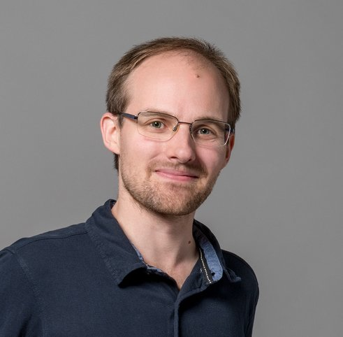

# Personal page of Simon Cruanes

## Presentation

I work at Aesthetic Integration in Austin, Texas, on
[Imandra](https://www.imandra.ai/), where I help
write a user friendly, powerful proof system based
on computational logic. I moved to Austin, Texas in January 2018.

Previously (2015-10 to 2017-10) I was at Inria Nancy doing a postdoc
with [Jasmin Blanchette](http://www4.in.tum.de/~blanchet/)
on a counter-example finder for higher order logic,
[nunchaku](https://github.com/nunchaku-inria/nunchaku/).

I completed my PhD after 3 years at
[Deducteam (INRIA)](http://deducteam.gforge.inria.fr/ "deducteam page"),
from October 2012 to September 2015,
under the supervision of
[Gilles Dowek](https://who.rocq.inria.fr/Gilles.Dowek/) and
[Guillaume Burel](http://www.ensiie.fr/~guillaume.burel/).
My work takes place in the field of first-order automated
deduction.
My thesis is titled
"Extending Superposition with Integer Arithmetic,
 Structural Induction, and Beyond" and can be found below.

Before the PhD, I was a student in
[École polytechnique](http://polytechnique.fr), in France,
where I obtained an engineering diploma in 2012,
then at
[EPFL](http://epfl.ch "EPFL website"), in Switzerland, where I got a master
degree in **Computer Science**.

I am interested in Artificial Intelligence, formal logic, programming
languages; classical music and opéra, science-fiction and more generally
by reading.

I used to be a member of the
[Binet Réseau](http://www.polytechnique.fr/eleves/binets/reseau/Accueil "Binet Réseau"),
an association in charge of the students' network in École polytechnique.

## Computer science

* Research engineer at [Veridis](http://veridis.loria.fr/) with
  Jasmin Blanchette, on model finding for higher-order logic.
* PhD thesis at [Deducteam](http://deducteam.gforge.inria.fr/)
  with Gilles Dowek and Guillaume Burel, on the topic of automated
  theorem proving.
* A 3 months and a half internship at the [ProVal](http://proval.lri.fr/ "laboratoire ProVal") lab in INRIA. The topic was about integrating `TPTP` provers in the [Why](http://why.lri.fr/ "why") software.
* 6 months internship in the Computer Science Lab in [SRI International](http://csl.sri.com "SRI International").
* I'm interested in the technology of _SAT solvers_. More about it on
 [SAT](sat.html "sat"). I'm also interested in first-order _automated theorem
 provers_ (in particular the technology of superposition, e.g.
 the provers [E](http://eprover.org) and [SPASS](http://www.spass-prover.org/)). I develop my own superposition prover, [zipperposition](https://github.com/c-cube/zipperposition/), as a research test bed.
* I converted the so called ["Pelletier problems"](http://www.springerlink.com/content/r10030507w282122/) (some small logical problems designed to test automated provers) in the [TPTP](http://tptp.org) format. The result is now [in Zipperposition](https://github.com/c-cube/zipperposition/tree/master/examples/pelletier_problems). The problem 28 is mistranslated (it seems to be satisfiable), although I could not find why. The last problems are not all translated.

## Publications and documents

My [dblp page](http://dblp.uni-trier.de/pers/hd/c/Cruanes:Simon) makes
a better job than me at tracking my academic papers.
Some of them can also be found [on HAL](https://hal.archives-ouvertes.fr/search/index/q/*/authFullName_s/Simon+Cruanes/).

* Superposition with Structural Induction, Frocos 2017 ([preprint](assets/frocos_17_paper.pdf))
* Satisfiability Modulo Bounded Checking, CADE 2017 ([preprint](assets/cade_17_paper.pdf))
* PhD thesis (draft) ["Extending Superposition with Integer Arithmetic, Structural Induction, and Beyond"](assets/thesis.pdf), and [the sources](assets/thesis.tar.gz), under Creative Commons.
* Master thesis on [First order reasoning in Yices2](assets/master_thesis_cruanes.pdf)
* [Detection of First Order Axiomatic Theories](http://link.springer.com/chapter/10.1007/978-3-642-40885-4_16)
and the [pre-print version](assets/theory_detection_free.pdf)
- [Logtk : A Logic ToolKit for Automated Reasoning and its Implementation](https://hal.inria.fr/hal-01101057/)

## Talks

- **Superposition with Structural Induction** (Talk at FroCoS, 2017) [slides](assets/talks/2017_frocos.pdf)
- **Sat Modulo Bounded Checking** (Talk at CADE 26, 2017) [slides](assets/talks/cade_2017.pdf)
- **Zipperposition, a new platform for Deduction Modulo** (LSV Cachan, 2017) [slides](assets/talks/2017_lsv_zipper.pdf)
- **Sat Modulo Bounded Checking** (Talk at VU Amsterdam, 2017) [slides](assets/talks/amsterdam_2017.pdf)
- **SMBC: Engineering a Fast Solver in OCaml** (Séminaire Ingénieur Inria, 2017 [slides](assets/talks/slides_seminaire_inge_2017.pdf))
- **Superposition+Structural Induction** (at WAIT 2016, Vienna, [slides](assets/talks/talk_induction_vienna_2016.pdf))
- **Engineering Nunchaku: A Modular Pipeline of Codecs** (Séminaire ingénieur Inria, 2016 [slides](assets/talks/talk_inge_inria_2016.pdf))
- **Nunchaku: Flexible Model Finding for Higher-Order Logic** (Montpellier, 2016 [slides](assets/talks/nunchaku_montpellier_2016.pdf))
- **Short Presentation of OCaml** ([slides](assets/talks/slides_presentation_ocaml.pdf))
- **Thesis Defense** ([slides](assets/talks/slides_thesis.pdf))
- **Wedding Boolean Solvers with Superposition: a Societal  Reform**,
    Deducteam seminar, 23rd January 2015 ([slides](assets/talks/slides_avatar.pdf))
- **Logtk: A Logic Toolkit for Automated Reasoning, and its Implementation**, PAAR 2014, 23 July 2014 ([slides](assets/talks/paar_2014_logtk.pdf))
- **Sequence: Simple and Efficient Iterators**, OCaml user meeting, 8th July 2014 ([slides](assets/talks/sequence.pdf))
- **Automated Recognition of First-Order Theories**, Frocos 2013 ([slides](assets/talks/frocos_2013.pdf))

## Teaching

- [lectures in MPSI](assets/mpsi2014.tar.gz) (classes préparatoires) in 2014

## GNU/Linux and free software

I am using several GNU/Linux distributions, currently debian and archlinux.
See [this page](linux.html "linux").

## Programs

Most of the programs I write and maintain nowadays
are [on my github profile](https://github.com/c-cube/);
most are in OCaml.
You can also take a look at the [documentation](software/)
of some of the libraries below (might be outdated).

* [containers](https://github.com/c-cube/ocaml-containers), a modular, ligthweight
    extension to OCaml's standard library.
    [Doc](https://c-cube.github.io/ocaml-containers/)
* [zipperposition](https://github.com/c-cube/zipperposition), a
  superposition prover written in OCaml. [Doc](http://c-cube.github.io/zipperposition/)
* [nunchaku](https://github.com/nunchaku-inria/nunchaku/), a model finder
  for higher-order logic, relying on CVC4, Kodkod, Paradox, and smbc (below).
* [smbc](https://github.com/c-cube/smbc/), a model finder for computational logic with datatypes and recursive functions.
* [datalog](https://github.com/c-cube/datalog), a bottom-up datalog engine
  written in OCaml.
* [sequence](https://github.com/c-cube/sequence), a small OCaml library for
    iterating on containers. [Doc](http://c-cube.github.io/sequence/)
* [gen](https://github.com/c-cube/gen), another style of OCaml iterators
* [logtk](https://github.com/c-cube/logtk) (**merged into Zipperposition**), a logic toolkit in OCaml, used in
  Zipperposition, with many data structures and algorithms.
- [qcheck](https://github.com/c-cube/qcheck),
  a QuickCheck inspired property-based testing for OCaml, and combinators to
  generate random values to run tests on. [Doc](http://c-cube.github.io/qcheck/)
* [OLinq](https://github.com/c-cube/olinq/), an in-memory query language for OCaml
* [OCaml-bigstring](http://c-cube.github.io/ocaml-bigstring/),
  an OCaml library to deal with bigarrays of bytes
* [maki](http://c-cube.github.io/maki/),
  an on-disk, content-addressed memoization library for OCaml

### Old scripts, hacks, and projects

* [abrasatcuda](https://github.com/c-cube/abrasatcuda "abrasatcuda"),
  a SAT-solver written in C and initially intended
  to run on CUDA. Written together with
  [Vincent Barrielle](https://github.com/vbarrielle)  as a project for a lecture.
* [db2xml.py](assets/db2xml.py), a small python script to extract an Android
  SMS database (say, after a backup) to a XML file that
  [SMS backup-restore](http://android.riteshsahu.com/apps/sms-backup-restore)
  can read back. **NO GUARANTEE** of it working at all, use at your own risk!
* [deref](assets/deref.ml), an ocaml script to replace symlinks by the content
  of the file they point to.
* [print.py](assets/print.py), in python, using `pycups` and `cherrypy` to provide a simple web form to print files

## Misc

* mail : `simon[dot]cruanes[dot]2007[at]m4x[dot]org`
* I am on irc (freenode, rezosup) with `companion_cube` as nickname.
* [pgp public key](assets/simon.asc "pgp public key")
* a [blog](https://blag.cedeela.fr) friends and me started a while ago (not very active)

